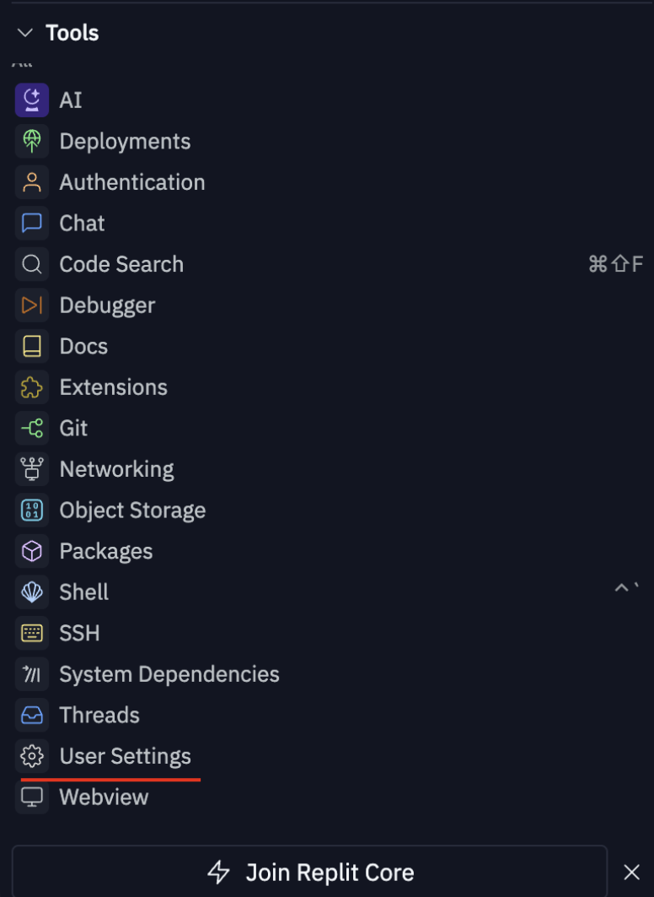

# AI tools overview 

## Table of Contents
1. [Coding](#coding)
2. [Text to Image](#text-to-image)
3. [Text to Video](#text-to-video)
4. [Presentations](#presentations)
5. [Text to speech](#text-to-speech)
6. [Additional Gen Ai tools](#additional-gen-ai-tools)

## Coding

### Overview

- **GitHub Copilot**: Provides real-time code suggestions as you type, which greatly speeds up the writing process. 
This is especially useful for boilerplate code and repetitive tasks. Copilot integrates easily with popular IDEs such 
as Visual Studio Code. However, it sometimes generates incorrect or unsafe code that requires manual review and 
correction. It also has limitations when working with very new or niche technologies.

- **OpenAI Codex**: It is the basis of GitHub Copilot and has more than a dozen programming languages. It can 
interpret natural language commands to generate code, making it versatile for a variety of programming tasks. 
But access is currently limited, and while it's great in many areas, its code can still require significant human 
oversight to ensure correctness and security.

- **Amazon CodeWhisperer**: Offers real-time code suggestions based on billions of lines of code, including 
snippets and complete functions. It analyzes code security, identifying vulnerabilities and providing solutions. 
It also supports customization based on internal libraries and best practices.However, its quality of 
suggestions may vary and they need further improvement.

- **Replit GhostWriter**: Provides real-time code completion, reducing the time spent writing boilerplate 
code and minimizing syntax errors. It integrates seamlessly with the online code editor Replit, allowing 
users to write, run, and debug code in one place. It is primarily useful in the Replit environment, potentially 
limiting its usefulness for developers who prefer other platforms.

- **Codeium**: Features advanced code autocomplete by analyzing existing code to suggest new segments that 
match the style and requirements of the project. It supports more than 70 programming languages and 
integrates with more than 40 editors, increasing flexibility for developers. Despite its high efficiency, 
its performance may vary depending on the complexity of the code and the specific language being used, 
requiring occasional manual tuning.

### Replit

Go to https://replit.com/ and press login

You can create an account using your Google, Facebook, or GitHub account.

If you are logging in for the first time, you will be asked to choose a template. Choose HTML, CSS, JS.

**What is Repl and how do I create it?**

Repl stands for read-evaluate-print loop, and it's an interactive programming environment for developers to create small projects.
There are three places in Replit where you can create a new repl.
One way is to click the Create Repl button located in the upper left corner of the home page.

After that, you can choose from a variety of Replit templates, including Python, Node, Java, HTML & CSS, Ruby, and more.

Choose stack and name your project:

In the free version of Replit, you are not allowed to create private projects. If you want to create a private project, 
you will need to upgrade to a paid subscription.

Once you're done naming your replica, click the blue `Create Repl` button.

After succesfull creation you will be redirected to the editor:

**Replit Files and Folders.**

In the upper left corner, you can click the file icon to add files and folders to your project.

To add a file, click the Add File icon.

To add a folder, click the Add Folder icon.

If you want to upload files or folders from your computer, click the three vertical dots icon.

If you want to delete files or folders, click the three dots icon next to the file you want to delete. Then select the delete option.
You can also right-click on the file and you'll see a list of options.

**Customize Replit settings.**

If you need to customize the editor settings for your project, click the user preferences tools on the left side of the editor page.

**Run project**

If you want to start the server for your project, click the green Run button at the top of the editor page.

When you click the Run button, you should see the results of your code in the Webview window on the right side of the editor page.

**How to use artificial intelligence to write code**

To use AI to write code, first select the AI option in the toolbox.

In the AI usage panel, you can let AI decide what you want to do, 
or select Generate to specify your task for the bot to generate code.

Make sure all 3 files are selected.

In the prompt, write: `Generate HTML and CSS code for a styled landing page for marketing my coffee shop. Code only no explanation`.
Copy the generated code into the appropriate html and css files.

Go to Webview and click “Run”. You should see your new website template:

Write in the AI prompt: add code to show animated popup on hovering the product items with item description.

Copy the generated code to the appropriate files.
Note: be careful as some code needs to be completely replaced and some code needs to be added to existing files, for example, like this CSS file:

Go to Webview and click Launch. You should see your new website template. Try hovering your cursor over a menu item:

Now let's add more features to your website.
Write in the AI prompt: `refactor the product list into a grid using CSS Grid`. Add product image placeholders if they are missing.

Copy the generated code to the appropriate files. Use the upload button to upload the images you will use. 
You may need to manually change the image names in the HTML file.

Go to Webview and click Run. You should see your new website template:

Note: If you see that the images are overlapping, go back to the AI prompt and write: `make all the images size to 200 pixels`.
If you see that hovering does not work, then return to the AI prompt and write: `refactor javascript code to work with the new layout and styles`.
Copy the generated code to the appropriate files.

Finally, let's expand the content of the website. Returning to the AI prompt, write: extend the website content to 
include our baristas and address sections. Make the baristas section also a grid. Add a sample barista card.
Copy the generated code to the appropriate files. Add more photos if necessary.
Go to Webview and click “Run”. You should see your new website template:

**Add chatbot to page.**

[BotPenguin](https://botpenguin.com/) supports integration with a variety of website platforms, including WordPress, Shopify, and regular HTML websites:
- WordPress: Use the provided plugin or shortcode.
- Shopify: Add the chatbot script to your Shopify theme.
- Custom HTML: Paste the provided JavaScript snippet before the closing </body> tag of your website's HTML code.

Go to the general settings of your chatbot.

And click “Install your Chatbot”

BotPenguin offers several options for launching a chatbot. For our first chatbot, we will choose Custom.

The next step is to choose how you want to install the chatbot on your website. Choose “I'll add myself” to launch it by yourself.

This will open a text box with the code that you need to paste into your HTML website.

When you're done, your website might look something like this:

## Text to Image 

### Overview

**Online platforms for generating images using AI**

At the time of developing the materials for this class, we were able to identify the following free online platforms for generating images from text:

- [Nightcafe](https://creator.nightcafe.studio/): This platform creates a unique image from a text description using artificial intelligence.
- [Starry AI](https://starryai.com/): Starry AI offers detailed control over some aspects, which makes the results more personal.
- [Pixray](https://replicate.com/pixray/text2image): This generator is considered the best free AI art generator.
- [Canva](https://www.canva.com/): Canva offers several AI-based image generation tools, including Text to Image, DALL-E by Open AI, and Imagen by Google Cloud.
- [Stockimg AI](http://stockimg.ai): A simple tool for generating images, logos, banners, and more.
- [Craiyon](https://www.craiyon.com/): This website allows you to try the famous OpenAI DALL-E.
- [Leonardo](https://app.leonardo.ai/): A reliable, if a bit finicky, image generator.
- [Bing Image Creator (Web)](https://www.bing.com/images/create): Microsoft's AI Text-to-Image generator based on DALL-E.
- DALL-E OpenAI
- [Picsart](https://picsart.com/): A free and simple online generator.
- [Fotor](https://www.fotor.com/): Fotor's AI image generator allows you to turn words into images.
- [Dream by Wombo](https://dream.ai/listing/804494e1-7d02-45e0-99b6-013ad2a60de7): This simple image generator is partially free.
- [DeepAI](https://deepai.org/): Fast and easy to use image generator from text.

## Text to Video

### Movie Maker Online

https://moviemakeronline.com/

Movie Maker Online is a free online video creation and editing tool. It doesn't require any software downloads and works right in your browser.

**Step 1: Open the resource**
Go to the website: Movie Maker Online.
On the main page, you will see the interface for uploading media files and the toolbar.

**Step 2: Upload your media files**
Click on the “Add Files” button.
Upload the required files:
- Videos in MP4, AVI, MOV formats.
- Photos in JPG, PNG formats.
- Audio in MP3, WAV formats.

**Step 3: Edit your video**

Add text:
- Select the “Add Text” option.
- Enter text and set the font, color, and location.

Trim the video:
- Select the video in the panel and choose the “Cut Video” option.
- Set the start and end points of the video.

Add music:
- Upload an audio file or choose a track from the library.
- Adjust the volume and sync with the video.

Effects:
- Add filters (black and white, sepia, etc.).
- Adjust the video speed (speed up, slow down).

**Step 4: Preview the result**
Click the Preview button to preview the edited video before saving.

**Step 5: Save the video**
Click Export.
- Select the video quality and format.
- Save the file to your device.

**Additional features**
Use ready-made templates to speed up the video creation process.
Integrate animated transitions between scenes.
Download videos without watermarks (after a short registration).

**Advantages of Movie Maker Online**
- Simple interface for beginners.
- Free access to basic features.
- No software installation required.
- You can create videos from any device (computer, tablet, or smartphone).

### CapCut 

https://www.capcut.com

### HeyGen

https://www.heygen.com

### Runway ML

https://runwayml.com

### Leonardo AI

https://leonardo.ai

### Eleven Labs

https://www.elevenlabs.io

## Presentations

### Gamma 

https://gamma.app

Gamma is a platform for creating interactive presentations, documents, and web pages that can be easily adapted for professional use.

**How to use Gamma**

1. Registration and login
- Go to Gamma.
- Sign up with your email or sign in with Google/Social Media.
2. Create a new project
- Click “New Doc” or “Create” on the home page.
- Choose a template for your presentation, document, or web page.
3. Add content
- Use blocks to add text, images, videos, or interactive elements.
- Choose Layouts to customize the layout of your page.
4. Add interactivity
- Use Interactive Elements to create sliders, buttons, links, or tabs.
- Integrate multimedia content like GIFs, video, or audio.
5. Preview and publish
- Click Preview to see what the page will look like.
- Share your project via a special link or export it as a PDF.

### Canva 

https://www.canva.com

Canva is a versatile tool for creating designs and visuals, including banners, infographics, and web pages.

**Get started with Canva**

1. Register and sign in
- Go to Canva.
- Register or sign in to your account.
2. Choose a format
- In the search box, type a format (e.g., web page, presentation, infographic).
- Choose a template or start with a blank canvas.
3. Edit your design
- Add elements: text, icons, images, graphics (click the “+” in the menu).
- Choose fonts and colors in the Styles tab.
- Drag and drop elements to place them on your canvas.
4. Integrate media
- Upload your own files (images, videos) or use the free Canva library.
- Add animations to your text or images in the Animate tab.
5. Export and share
- Click Share or Download to save your project.
- Export your design as a PDF, PNG, or HTML file for integration into web resources.

### Genially 

https://genially.com

Genially is a platform for creating interactive and multimedia presentations, infographics, and microsites.

**How to use Genially**

1. Registration and login
- Visit Genially.
- Register or log in to your account.
2. Create a new project
- Click Create Genially.
- Choose the type of content: presentation, interactive report, microsite, or infographic.
3. Edit
- Choose a template or start from scratch.
- Add text blocks, images, videos, or interactive buttons.
- Use the Resources tab to access graphics, icons, and animations.
4. Add interactivity
- Create hyperlinks between pages or interactive elements.
- Integrate videos from YouTube or other sources.
- Use animation effects to create dynamic transitions.
5. Publishing
- Preview your project in Preview.
- Publish it online using a special link or embed it on your website using HTML code.

## Text to speech 

### TTSMaker Pro

https://pro.ttsmaker.com/studio/uk/tts

### Natural Reader

https://www.naturalreaders.com/online/ \
https://www.naturalreaders.com/commercial/

### Text To Speech Free

https://ttsfree.com/text-to-speech

### ttsMP3

https://ttsmp3.com/ai

**Here are some of the features you can use when creating a speech:**

1. Add a break

Mary had a little lamb \<break time=“1s”/\> whose fleece was as white as snow.

Emphasizing words
I've already told you that I \<emphasis level=“strong”\>really like\</emphasis> this person.

2. Speed.

For dramatic purposes, you can \<prosody rate=“slow”>slow down the speed of your text\</prosody>.
Or, if you're in a hurry, you can speed it up a bit.

3. Step.

Do you like synthesized speech with a pitch that is higher than normal?
Or do you prefer your speech \<prosody pitch=“-20%”>with a slightly lower pitch?</prosody>

4. Whisper.

\<amazon:effect name=“whispered”>If you make any noise,</amazon:effect> she said, <amazon:effect name=“whispered”>they'll hear us.</amazon:effect>

5. Conversations.

It is possible to switch between speakers in the text. Just use the following format:

[speaker:Brian] Hi, Emma.\
[speaker:Emma] Hi, Brian.\
[speaker:Brian] How are you?
[speaker:Emma] I'm fine. Can I invite you in for a cup of tea?

Please note: remove any diacritics from speakers' names when using this, Léa = Lea, Penélope = Penelope

### Speechify

https://speechify.com/text-to-speech-online/ukrainian/

### Voicemaker

https://voicemaker.in/

### Elevenlabs

https://elevenlabs.io/languages/ukrainian

### Speechgen.io

https://speechgen.io/

### Google Text-to-speech Engine

https://cloud.google.com/text-to-speech#demo \
https://cloud.google.com/text-to-speech/pricing \
https://cloud.google.com/text-to-speech/docs/basics

## Additional Gen Ai tools 

**Chatbots:**

1. [Gemini](https://gemini.google.com/) is Alphabet's/Google's competitive product vs. ChatGPT, previously Bard,
integrated with Google Docs and Gmail

2. Le Chat by [Mistral.ai](https://mistral.ai/) Europe-based alternative to GenAI tools like ChatGPT

3. [Claude](https://claude.ai/) by Anthropic

4. [Meta.ai](https://www.meta.ai/) Meta’s (facebook) chatbot based on Llama

**Other tools:**

1. [Grammarly](https://www.grammarly.com/) (Checking grammar and improving writing)

2. [Beautiful.ai](https://www.beautiful.ai/) (Generating presentations)

3. [Frase](https://www.frase.io/) (Writing articles and research)

4. [Synthesia](https://www.synthesia.io/) (Video avatar generation tool, the first tool with ‘expressive’ avatars
showing emotions based on what they are saying)

5. [Invideo](https://ai.invideo.io) (Excellent video generation platform to create ‘faceless’ videoclips, many
voice options, integration to B-Roll video platforms, and chat-based interface,
helping you to generate a marketing video in 60 seconds)

6. [Happyscribe](https://www.happyscribe.com/) (Automatic transcriptions of video and audio content, excellent for
meeting minutes if you record your meetings!)

7. [ChatPDF](https://www.chatpdf.com/) (summarize any PDF)

8. [Julius.ai](https://julius.ai/) for Data analysis, generation of charts, etc. (used for our example)

9. [Microsoft VIVA Goals](https://www.microsoft.com/en/microsoft-viva/goals?market=af) (Goal setting, AI support for OKR definitions etc, in
development)

10. [OpenAI Sora](https://openai.com/sora/) - a revolutionary tool to generate high-end videos purely with text prompts

